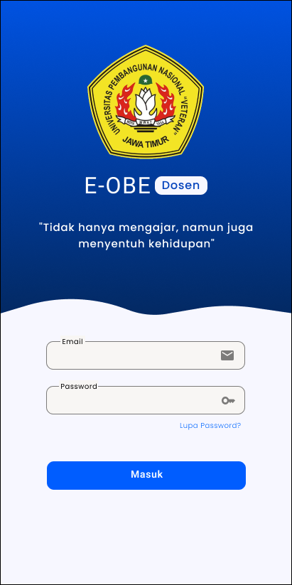
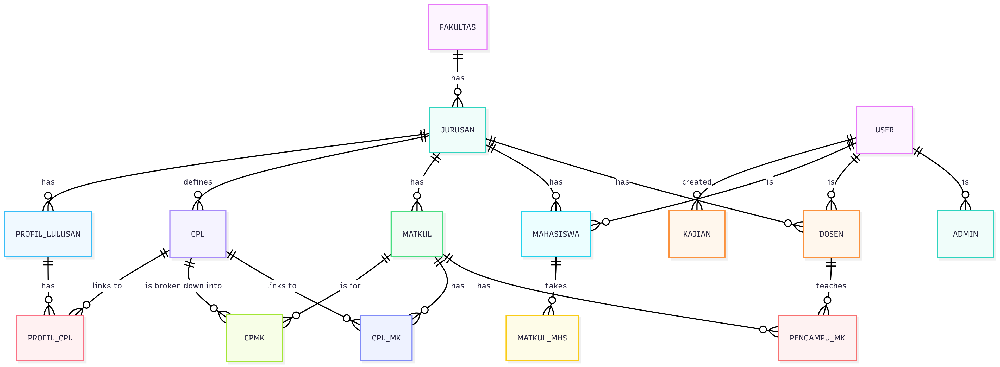
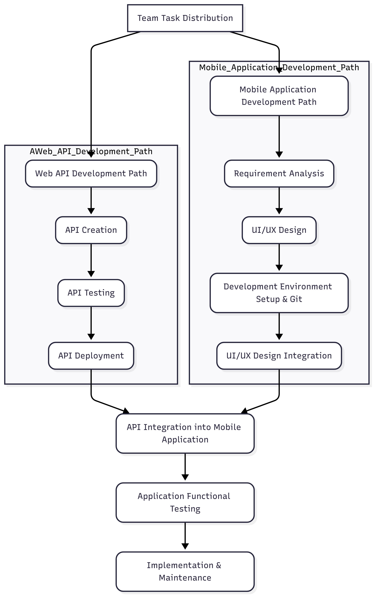

# OBE System Migration – Internship Project

This repository showcases the work I contributed during my internship at **PT. iGS Indonesia Groups** (Feb – Jul 2024). The main objective was to migrate an existing Outcome-Based Education (OBE) system from a web platform into a functional Android application.

---

## Project Scope

-  **Backend Development**: Built RESTful API using Laravel.
-  **Data Cleaning**: Normalized and refactored messy MySQL datasets from legacy systems.
-  **Android App Migration**: Collaborated with Android developer team to shift web functionality into mobile format.
-  **Deployment**: Hosted the Laravel backend to cloud environment for integration testing.

---

##  My Role
- Backend engineer responsible for:
  - Building APIs
  - Cleaning dataset
  - Connecting backend to Android app
  - Deploying the Laravel project to shared hosting

---

##  Tech Stack
- Laravel (PHP), MySQL
- Postman for API testing
- Android Studio (Kotlin)
- Firebase (used in part of Android build)
- GitHub for version control

---

##  Documentation

### Backend Preview (Endpoint API)
- Screen 1: authentication
  - POST /login
  
- Screen 2: home page
  - GET /user
  - GET /halaman-utama-nama
  - GET /halaman-utama-profile
  
- Screen 3: course
  - GET /matkul
  - GET /matkul/{id_matkul}/{id_pengampu}

- Screen 4: rps & evalution details
  - GET /detailrps/minggu/{id_matkul}
  - GET /evaluasi/{id_matkul}/{id_detailrps}/{id_evaluasi}
  - GET /subcpmk/{id_detailrps}
  - POST /evaluasi
  - PUT /evaluasi/{id_evaluasi
  - DELETE /evaluasi/{id_evaluasi}

- Screen 5: student assessment
  - GET /mahasiswa-by-matkul/{id_matkul}
  - GET /evaluasi-mahasiswa-detail/{id_user}
  - POST /evaluasi-mahasiswa-detail/{id_user}/{id_matkul}
  - PUT /evaluasi-mahasiswa-detail/{id_user}/{id_matkul}/{id_evaluasimhs}
  - DELETE /evaluasi-mahasiswa-detail/{id_user}/{id_matkul}/{id_evaluasimhs}
  - POST /evaluasi_mahasiswa_hitung/{id_matkul}/{id_user}/{id_evaluasimhs}/{id_pengampu}

- Screen 6: cpl
  - GET /matkul-cpl/{userId}
  - GET /total_cpl/{id_user}

### Android UI (OBE App)  

### Database ERD  

### Workflow

---

## 🚫 Disclaimer
This repository only contains documentation and non-sensitive assets. The source code cannot be published due to company policy and intellectual property protection.
